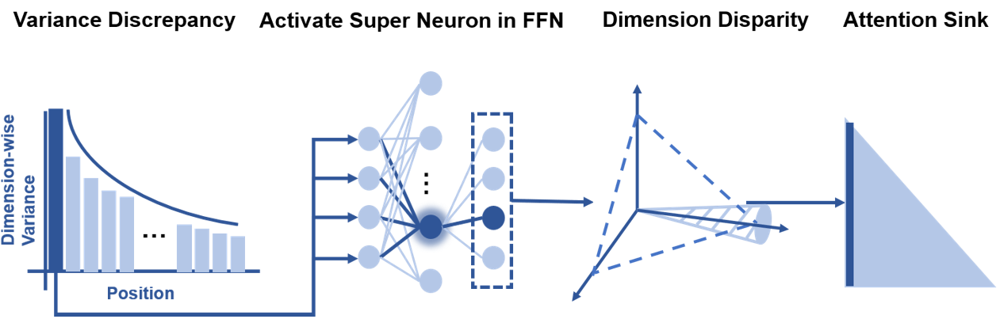

# HeadNorm for Attention Sink Mitigation

This repository contains the minimal training code for the experiments in
**The Structural Origin of Attention Sink: Variance Discrepancy, Super Neurons, and Dimension Disparity**.

The code is adapted from Karpathy's nanoGPT training loop, but the model is a
compact Llama-style decoder with RMSNorm, SwiGLU, RoPE, tied embeddings and
optional HeadNorm. The repository is intentionally scoped to two pretraining
conditions:

- **Baseline**: standard Llama-style causal softmax attention.
- **HeadNorm**: the same architecture with head-wise RMSNorm applied after
  value aggregation and before the attention output projection.

## Method

The paper identifies attention sinks as a structural consequence of causal
value aggregation. The first token does not aggregate previous values, so it
retains higher dimension-wise variance than later tokens. This variance
discrepancy is propagated by the attention output projection, amplified by FFN
super neurons, and concentrated into a few outlier dimensions. The resulting
dimension disparity can lock subsequent query-key projections onto the first
token.

HeadNorm targets the source of this chain. For each attention head `h` and
position `t`, it normalizes the aggregated value output before `W_O`:

```text
o_hat[t, h] = o[t, h] / RMS(o[t, h]) * gamma[h]
```

This stabilizes the scale of value aggregation outputs across positions and
heads while preserving the standard softmax attention mechanism.



## Repository Layout

```text
.
├── config/
│   ├── baseline.py      # standard Llama-style control
│   └── headnorm.py      # HeadNorm experiment
├── data/
│   └── openwebtext/
│       └── prepare.py   # OpenWebText preprocessing
├── configurator.py      # nanoGPT-style config override helper
├── model.py             # Llama-style decoder with optional HeadNorm
└── train.py             # single-GPU/DDP pretraining script
```

## Installation

```bash
pip install torch numpy datasets tiktoken tqdm wandb
```

`wandb` is optional and only used when `wandb_log=True`.

## Data

Prepare OpenWebText into `train.bin` and `val.bin`:

```bash
python data/openwebtext/prepare.py
```

The training script expects the dataset under `data/openwebtext/`.

## Training

Baseline:

```bash
torchrun --standalone --nproc_per_node=8 train.py config/baseline.py
```

HeadNorm:

```bash
torchrun --standalone --nproc_per_node=8 train.py config/headnorm.py
```

For a quick local smoke test:

```bash
python train.py config/headnorm.py --device=cpu --compile=False --max_iters=2 --eval_interval=1 --eval_iters=1 --batch_size=2 --block_size=64 --n_layer=2 --n_head=2 --n_embd=128
```

## Configuration

Both experiments use the same model and training script. The experimental
switches are:

```python
enable_headnorm = False  # baseline
enable_headnorm = True   # HeadNorm
headnorm_shared_weights = False
```

The default configs follow the nanoGPT/OpenWebText setup with a 12-layer,
12-head, 768-dimensional Llama-style model. Adjust `batch_size`,
`gradient_accumulation_steps`, `block_size`, and `max_iters` according to the
available hardware.

## Checkpoints

Checkpoints are written to `out/baseline` or `out/headnorm` by default. Resume
training with:

```bash
python train.py config/headnorm.py --init_from=resume
```

## Citation

```bibtex
@inproceedings{li2026structural,
  title={The Structural Origin of Attention Sink: Variance Discrepancy, Super Neurons, and Dimension Disparity},
  author={Li, Siquan and Jiang, Kaiqi and Sun, Jiacheng and Hu, Tianyang},
  booktitle={International Conference on Machine Learning},
  year={2026}
}
```
